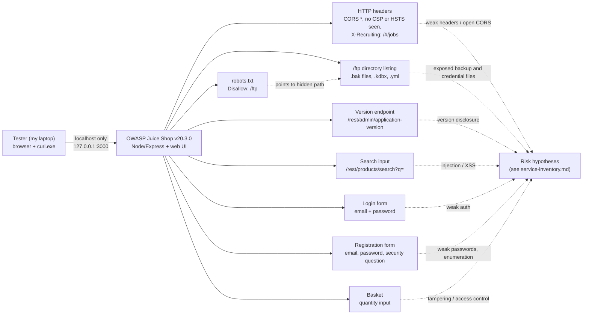

# Attack-Surface Diagram

Target: OWASP Juice Shop v20.3.0 at 127.0.0.1:3000 (isolated local lab, nothing else in scope).

```mermaid
flowchart LR
    T["Tester (my laptop)<br/>browser + curl.exe"] -- "localhost only<br/>127.0.0.1:3000" --> J["OWASP Juice Shop v20.3.0<br/>Node/Express + web UI"]

    J --> H["HTTP headers<br/>CORS *, no CSP or HSTS seen,<br/>X-Recruiting: /#/jobs"]
    J --> R["robots.txt<br/>Disallow: /ftp"]
    J --> F["/ftp directory listing<br/>.bak files, .kdbx, .yml"]
    J --> V["Version endpoint<br/>/rest/admin/application-version"]
    J --> S["Search input<br/>/rest/products/search?q="]
    J --> L["Login form<br/>email + password"]
    J --> G["Registration form<br/>email, password, security question"]
    J --> B["Basket<br/>quantity input"]

    H -. "weak headers / open CORS" .-> X["Risk hypotheses<br/>(see service-inventory.md)"]
    R -. "points to hidden path" .-> F
    F -. "exposed backup and credential files" .-> X
    V -. "version disclosure" .-> X
    S -. "injection / XSS" .-> X
    L -. "weak auth" .-> X
    G -. "weak passwords, enumeration" .-> X
    B -. "tampering / access control" .-> X
```
